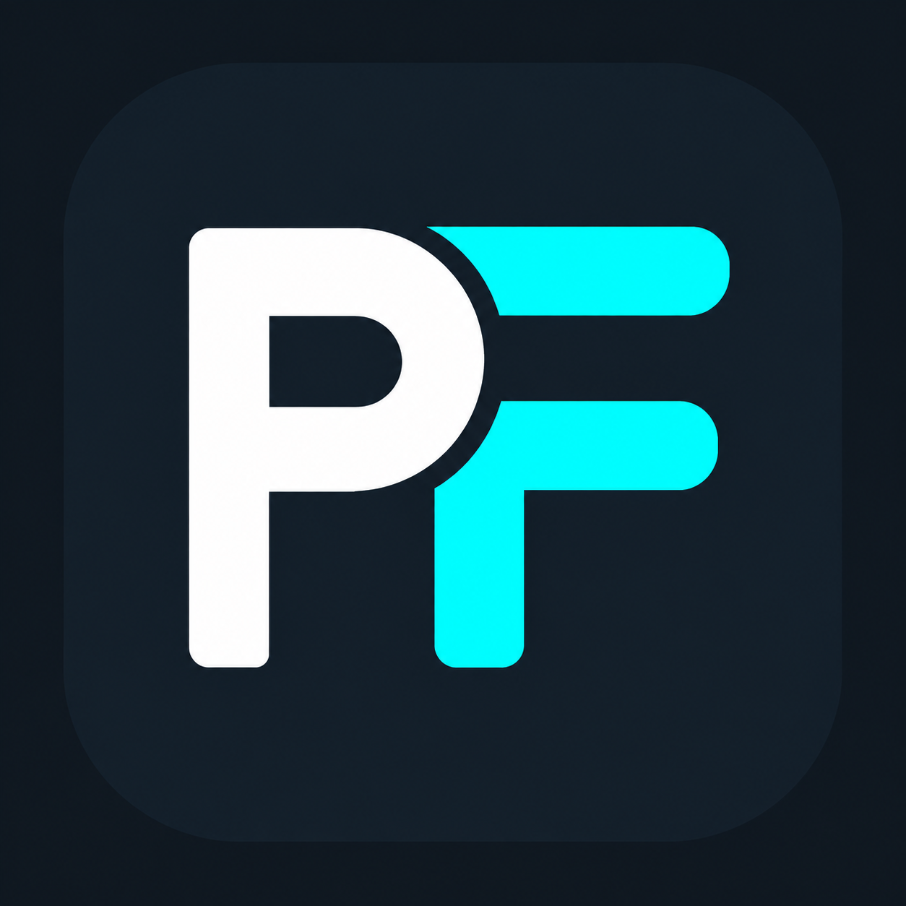
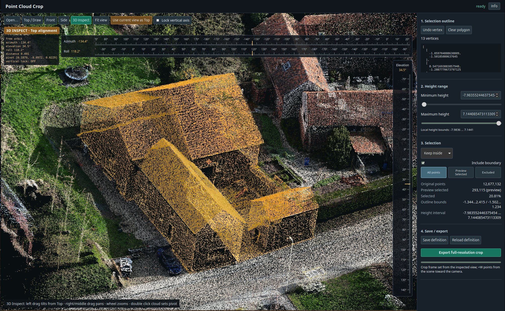

<h1>
  
  PointFrame
</h1>

PointFrame is a local-first point-cloud alignment and precision cropping tool.
It provides fixed orthographic views, free 3D inspection, polygon and height
selection, and full-resolution PLY exports while leaving the source file
unchanged.



*PointFrame 3D Inspect with precision Azimuth, Elevation, and Roll controls.*

## Features

- Local point-cloud viewing and processing.
- Top, Front, Side, and free 3D Inspect views.
- Precision Azimuth, Elevation, and Roll controls.
- Editable polygon selection with local height limits.
- Inside or outside selection and live preview counts.
- Automatic crop-frame alignment and **Use current view as Top**.
- Full-resolution raw and aligned PLY exports.
- Safe versioned export folders that do not overwrite silently.
- Native dialogs for opening point clouds and choosing export destinations.
- Optional PyWebView desktop window with browser fallback.

## Supported formats

PointFrame 0.1.1 supports **binary PLY** files with vertex properties:

- `x`, `y`, and `z` required.
- `red`, `green`, and `blue` optional.
- `nx`, `ny`, and `nz` optional.

Points without RGB values use a neutral preview color. Exports preserve source
properties. Aligned exports rotate normals when present and do not create them
when absent.

## Installation

### Ubuntu 26.04 package

Download the latest `.deb` from
[GitHub Releases](https://github.com/Maysker/PointFrame/releases) and install it
with:

```sh
sudo apt install ./pointframe_0.1.1_amd64.deb
```

Then launch PointFrame from the application menu or with:

```sh
pointframe
```

### Source installation

PointFrame requires Python 3.12 or newer. From the project directory, install
the desktop application and its GTK based PyWebView shell:

```sh
python -m pip install -e '.[desktop]'
```

For browser-only use:

```sh
python -m pip install -e .
```

Native open and export dialogs currently use Zenity on Linux. If PyWebView or
its GTK renderer is unavailable, PointFrame opens the local interface in the
default browser.

## Usage

Open the start screen and choose a PLY file:

```sh
pointframe
```

Open a specific file directly:

```sh
pointframe /path/to/cloud.ply
python -m pointframe /path/to/cloud.ply
```

Use **Open…** in the active viewer to switch to another PLY without restarting
PointFrame. Cancelling the native picker leaves the current cloud unchanged.

Useful options:

```sh
pointframe /path/to/cloud.ply --output-dir /path/to/exports
pointframe --preview-points 500000
pointframe --no-open --host 127.0.0.1 --port 8765
```

## 3D Inspect controls

- **Left drag:** Free orbit.
- **Right or middle drag:** Pan.
- **Mouse wheel:** Zoom.
- **Double click:** Set the orbit pivot.
- **Azimuth:** Rotate around the vertical axis.
- **Elevation:** Rotate above or below the scene.
- **Roll:** Rotate around the viewing axis and level the view.
- **Lock vertical axis:** Constrain inspection around the current Top alignment.
- **Use current view as Top:** Set the crop frame from the inspected view.

## Crop/export workflow


*Polygon and height-based point-cloud selection in Top / Draw view.*

1. Open a binary PLY point cloud and wait for preview preparation.
2. Review alignment in Top, Front, Side, and 3D Inspect views.
3. In **Top / Draw**, click to create the selection polygon. Drag vertices to
   move them, click or drag an edge to insert one, and right click a vertex to
   delete it.
4. Set the minimum and maximum local height and choose whether to keep points
   inside or outside the crop volume.
5. Save the crop definition if desired.
6. Select **Export full-resolution crop**. Without `--output-dir`, choose a
   destination using the native folder picker.

Each versioned export directory contains:

- `crop_raw.ply`
- `crop_aligned.ply`
- `crop_definition.json`
- `crop_report.json`

Exports use `crop_001`, `crop_002`, and later available numbers. Replacing the
latest export requires an explicit confirmation.

## Workspace behavior

PointFrame keeps previews and saved crop definitions outside the source PLY
directory. The workspace for each source path is:

```text
$XDG_DATA_HOME/pointframe/workspaces/<source-stem>-<path-hash>/
```

If `XDG_DATA_HOME` is unset, PointFrame uses:

```text
~/.local/share/pointframe/workspaces/<source-stem>-<path-hash>/
```

Opening the same source path reuses its workspace. Source PLY files remain in
place and are not uploaded or copied through the browser. User exports are
stored in the selected export directory, separate from the application
workspace.

## Current status: 0.1.1

Version 0.1.1 was released on 23 September 2026. It supports the local Linux
desktop workflow described above.

## Roadmap

- LAS and LAZ input support.
- Installable application packaging beyond the current Python project install.

These items are planned future work and are not supported in version 0.1.1.

## Repository

[https://github.com/Maysker/PointFrame](https://github.com/Maysker/PointFrame)

## License

PointFrame is released under the [MIT License](LICENSE).
